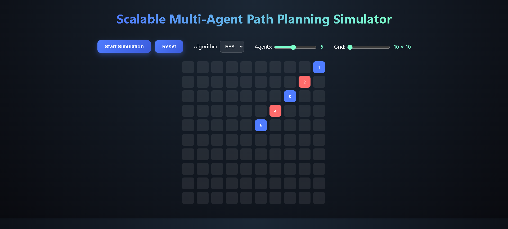
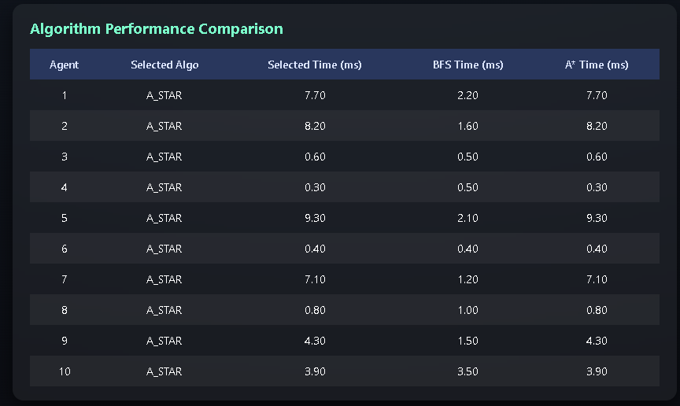

# 🚀 Scalable Multi-Agent Path Planning Simulator

A web-based simulation platform to **design, visualize, and benchmark classical path-planning algorithms**
(**BFS** and **A\***) in a **scalable multi-agent grid environment**.

---

## 📌 Overview

This project simulates multiple autonomous agents navigating a 2D grid while avoiding collisions.  
It allows real-time comparison of **Breadth-First Search (BFS)** and **A\*** under varying grid sizes and agent counts.

The simulator focuses on **algorithmic trade-offs, scalability, and performance benchmarking**.

---

## ✨ Key Features

### 🧠 Algorithms
- Breadth-First Search (BFS)
- A* Search with Manhattan distance heuristic

### 🤖 Multi-Agent System
- Dynamic agent count (1–10 agents)
- Collision avoidance between agents
- Independent path planning per agent

### 📏 Scalability Controls
- Grid size slider (10×10 → 30×30)
- Agent count slider (1 → 10)

### 📊 Algorithm Benchmarking (Core Feature)

For every agent movement:
- The selected algorithm executes visually
- **Both BFS and A\*** are benchmarked internally
- Execution times are displayed side-by-side

| Agent | Selected Algorithm | Selected Time (ms) | BFS Time (ms) | A* Time (ms) |
|------|-------------------|-------------------|--------------|-------------|

This ensures fair comparison under identical conditions.

---

## 🎨 Interactive UI
- Click-to-assign target cells
- Dynamic robot selector
- Real-time grid visualization
- Responsive design for large grids

---

## 🧩 System Design

### Architecture
- Agent abstraction encapsulates state and planning
- Grid engine dynamically resizes and re-renders
- Algorithm logic decoupled from UI
- Benchmarking separated from movement logic

### Design Principles
- Separation of concerns
- Scalability-first approach
- Reusable algorithm implementations
- Clean and incremental Git history

---

## 🧪 Performance Insights

### BFS
- Explores uniformly
- Higher node expansion on large grids
- Guarantees shortest path

### A*
- Heuristic-guided exploration
- Fewer nodes visited
- Better scalability on larger grids

The simulator visually and numerically demonstrates these trade-offs.

---

## 🛠️ Tech Stack
- HTML5
- CSS3
- Vanilla JavaScript (no frameworks)

---

## ▶️ How to Run

```bash
git clone https://github.com/samit-gupta/multi-agent-web-simulator
```

---

## 📸 Screenshots

### Small Grid (10×10)


### Large Grid (30×30)


### Algorithm Benchmarking Table


---

## 🎯 Learning Outcomes

- Developed a strong understanding of **graph traversal algorithms** such as **BFS** and **A\*** through practical implementation  
- Learned to compare algorithms using **real performance metrics** instead of theoretical analysis alone  
- Designed a **scalable multi-agent system** with collision avoidance and independent planning  
- Gained experience in **benchmarking algorithms under identical conditions**  
- Improved skills in **clean frontend system design** using vanilla JavaScript  
- Understood **time–space trade-offs** and how heuristics impact search efficiency  

---

## 👤 Author

**Samit Gupta**  
B.Tech Computer Science and Engineering  

- GitHub: https://github.com/samit-gupta  
- LinkedIn: https://linkedin.com/in/samit-gupta  

---

## 🏆 Why This Project Matters

This project goes beyond implementing path-finding algorithms by focusing on **scalability, benchmarking, and system behavior**.

Instead of only visualizing paths, it:
- Compares **BFS vs A\*** under identical grid and agent conditions  
- Measures execution time and node exploration objectively  
- Demonstrates how algorithm choice impacts performance as scale increases  

These concepts are highly relevant to **software engineering internships**, where understanding **trade-offs, performance, and system design** is more important than isolated algorithm knowledge.
